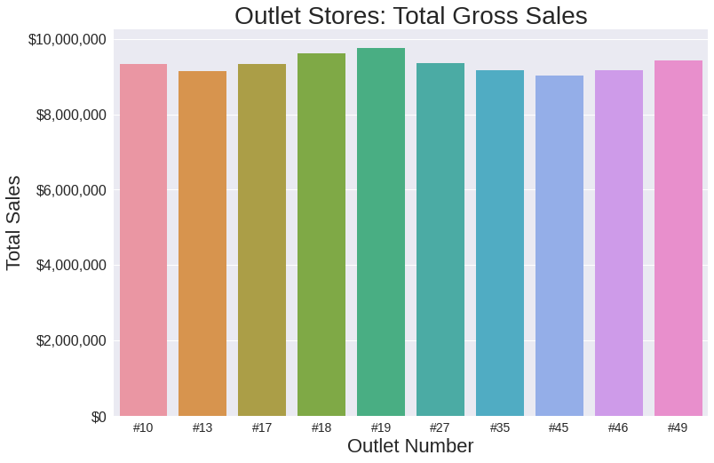

# Food Sales Predictions
## A Deep Dive Into Outlet Sales 

**Author**: Justin Faber

### Business problem:

What metrics influence total outlets sales? Is there a way that we can better predict sales based on historical information? Let's find out! 

### Data:
We're going to start this journey with historical sales information. 8,523 rows of it to be exact! We have information such as what type of item was sold, its visibility in the store, the size of the store, and the total sales. Hopefully this will be enough data for us to build our model! 

## Methods
- To prepare our data for this project we did the following:
  - Removed any duplicate rows from within our dataset
  - Explored any missing values from within our data
    -  Most missing data we were able to locate the correct value based on other information from within the data itself (ex: item weight by item identifer)
    -  The remaining misisng values (which were all in the 'Outlet_Size' column) - we simply marked as "unknown" so that we could keep the rest of our data in there
  -  Categorical columns with inconsistent values were fixed
     -  For example, the 'Item_Fat_Content" column had 'Low Fat" marked in three different ways: 'Low Fat', 'LF', and "low fat". These were consolidated into just "Low Fat" for consistency
  -  We looked for any potential outliers from within our dataset, but found nothing so far outside of the norm that warranted removal, so we left all remaining data in the dataset for further exploration!

## Results
Our first goal was to better understand our data, and some of the bigger takeaways we could make initially. The first thing I wanted to better understand was which categories produced the largest sales volume? Certainly this would be a focal point if your goal is to predict overall sales. I wanted to take a look at the top three item categories for sales between our different oulet types

#### Top Categorical Sales - by Outlet Type

> What we're learning so far is that total sales by outlet type is pretty similar across our different outlet types! Every category is a close race, regardless of which type of outlet we're looking at. But also noticable, is that each outlet type has a slightly better area than the rest. Grocery stores outsell everyone else in Fruits & Vegetables, while Supermarket Type 3 gets the nod for Household Goods, and Supermarket Type 1 wins by a hair in the Snack Foods department. 

#### Total Sales By Outlet

> Our entire dataset is comprised of sales from 10 different unique outlet locations. In looking at total sales for each of them individually, we can see that they are all extremely close! Every outlet that we have shows sales beteen 8.5M and 10M total. Between our first visualization and this one, it's easy to see that simply looking at categories of sales and which outlets they belong to, isn't going to be enough to help us predict sales moving foward. That's OK though, it's not supposed to be easy! This is where machine learning can help! It can find correlations and connections in our data that may not seem intuitive for us initially. Let's make some models! 

## Model

After exploring and testing multiple models, our highest performing model for our data was a random forest model

This final model had an RMSE of 1,076.12 and an R^2 of 59.76%

While not "perfect" by any stretch of the imagniation, this model can still provide some valuable insight into our sales, as it accounts for nearly 60% of the sales variance in our data. 

## Recommendations:

We need to continue to gather more data to help the model. While we can use the model to provide us some insight for future decisions, an R^2 of just below 60% can be improved upon. We need to make it a point to gather as much data as we can in the coming months to feed our model more information. With more information we should be able to further improve the accuracy of our model and get to an R^2 number that we can all be comfortable with! 

### For further information

For any additional questions, please contact **JFaberSFSD@gmail.com**
